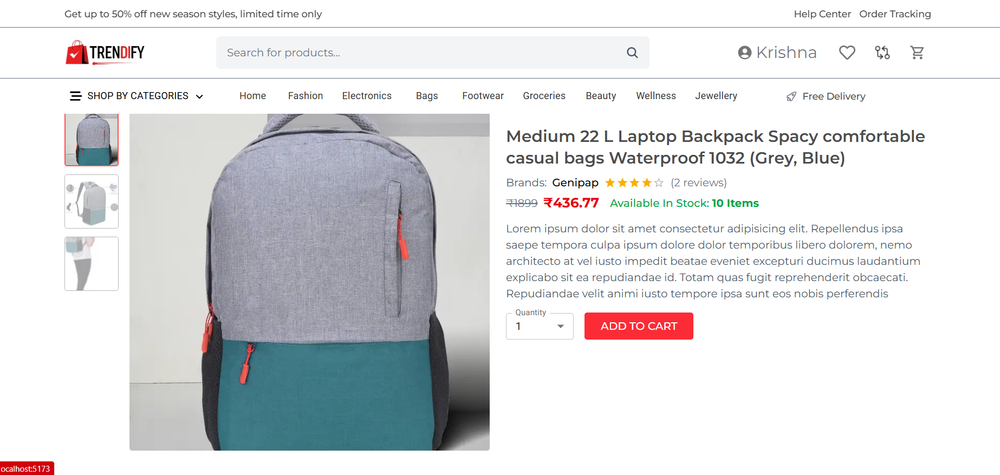

## 🛍️ Trendify - E-Commerce Platform

**Trendify** is a scalable and full-featured e-commerce web application built using **React.js (frontend)** and **Spring Boot + MongoDB (backend)**. It supports a rich shopping experience with features like user authentication, product listing, cart and order management, OTP-based verification, and a content-based **product recommendation system** powered by **Python ML** and integrated via **Apache Kafka**.

---

## 🚀 Tech Stack

### 💻 Frontend
- React.js
- TailwindCSS
- Axios
- React Router
- React Toastify

### 🛠️ Backend
- Spring Boot
- MongoDB
- Spring Security + JWT
- Java Mail Sender (OTP)
- Apache Kafka (Producer + Consumer)
- ModelMapper

### 🤖 Machine Learning
- Content-Based Product Recommendation System
- Python (scikit-learn / pandas, FastAPI)
- Kafka Integration (Spring Boot Producer → Python Recommender → Spring Boot Consumer)

---

## 📁 Project Structure

### 🔐 AuthController.java
- Register, Login with JWT token
- Email OTP Verification
- Forgot Password & Reset with OTP

### 📦 ProductController.java
- List all products
- Filter by Category, Subcategory
- Product Details Page
- Triggers recommendation event when product is viewed

### 🛒 CartController.java
- Add/Remove/Update products in user cart
- User-specific cart stored in MongoDB

### 📦 OrderController.java
- Place order
- View user’s orders
- Order summary with price breakdown

### 📰 BlogController.java
- Fetch latest blogs for homepage
- CRUD for admin on blogs

### 🔄 RecommendationController.java
- API endpoint `/recommend/{productId}`
- Publishes a **product view event** to Kafka
- Returns an acknowledgement message

### 📤 ProductViewProducer.java
- Publishes `{userId, productId, timestamp}` to Kafka topic `product_views`

### 📥 RecommendationConsumer.java
- Listens to `product_views` topic
- Calls **Python FastAPI recommender** (`/recommend/{productId}?top_n=6`)
- Receives recommendations (only **IDs** of similar products)
- Logs/stores them for retrieval in product detail page

---

## 🔐 Authentication Flow

1. User registers → Email OTP sent for verification  
2. Upon verification → JWT Token issued for login  
3. Protected APIs require JWT in headers  
4. Forgot Password uses OTP → reset password securely  

---

## 🤝 Features

- ✅ User authentication with OTP verification  
- ✅ Secure token-based session using JWT  
- ✅ Product CRUD and category-wise filtering  
- ✅ Shopping cart and checkout flow  
- ✅ Order placement and order history  
- ✅ **Asynchronous content-based ML recommendations (via Kafka + Python)**  
- ✅ MongoDB as flexible NoSQL data store  

---

## 📦 ML Recommendation System (Python + Kafka)

- Uses product **title, description, category, and brand** to find similar items.  
- Implemented in **Python (FastAPI)**.  
- **Workflow**:  
  1. When user views a product → Spring Boot publishes event to Kafka.  
  2. Consumer listens → Calls FastAPI recommender with productId.  
  3. FastAPI returns **list of recommended product IDs**.  
  4. These IDs are stored/logged → fetched in product detail page for display.  

Example Response from FastAPI:

```json
{
  "recommendations": [
    "685358076fbc0d31e1ca78a5",
    "6853590d6fbc0d31e1ca78a7",
    "685359926fbc0d31e1ca78a8",
    "6852f847ef343f31db09e3c3",
    "685358746fbc0d31e1ca78a6",
    "685357796fbc0d31e1ca78a4"
  ]
}
````

---

## 🧪 Sample Product Categories

* Fashion → Men’s/Women’s/Kids’ Wear
* Electronics → Mobiles, Laptops, Smartwatches
* Footwear, Groceries, Bags, Beauty, Wellness, Jewellery

---

## ⚙️ Setup & Run

### 🔧 Backend

```bash
cd backend
./mvnw spring-boot:run
```

Make sure `application.yml` is configured with:

* MongoDB URI
* Mail credentials
* Kafka config

### 🧑‍🎨 Frontend

```bash
cd frontend
npm install
npm run dev
```

Set API base URL inside Axios config or `.env` file.

---

## 🔒 Environment Variables

For Spring Boot (`application.yml`):

```
spring.data.mongodb.uri=
spring.mail.username=
spring.mail.password=
jwt.secret=
kafka.bootstrap-servers=
```

---

## 🌐 Deployment

You can containerize the app using Docker and deploy to AWS:

* Dockerfiles for frontend and backend
* Docker Compose for local setup
* MongoDB Atlas for DB
* EC2 + Nginx for hosting

---

## 📸 Screenshots





---

## 🧠 Future Enhancements

* Razorpay/Stripe integration for payments
* Admin dashboard for analytics
* **Store recommendations in Redis for faster retrieval**
* Collaborative filtering using user behavior
* Notification system using WebSocket

---

## 📣 License

This project is under the MIT License. Feel free to use and extend!

---

## 🙌 Credits

Developed with ❤️ by Krishna Kumar Sah
