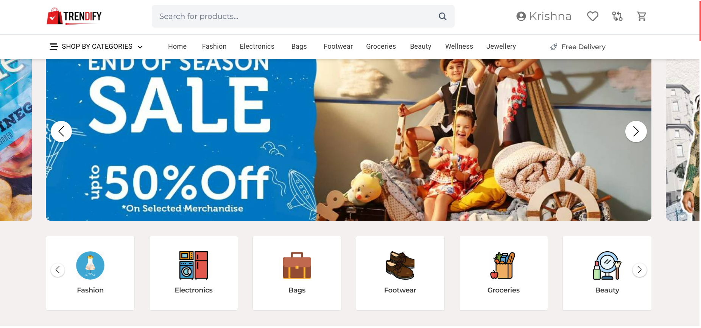
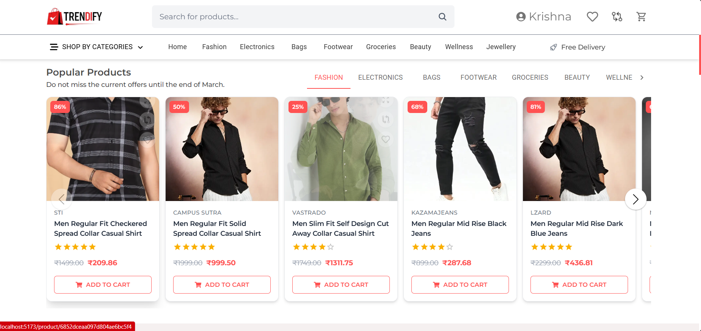
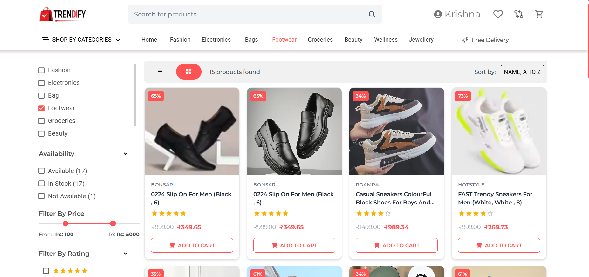
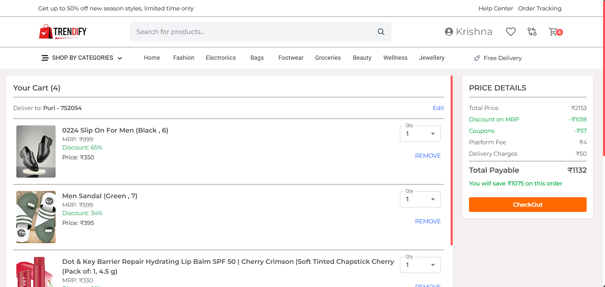

## 🛍️ Trendify - E-Commerce Platform

**Trendify** is a scalable and full-featured e-commerce web application built using **React.js (frontend)** and **Spring Boot + MongoDB (backend)**. It supports a rich shopping experience with features like user authentication, product listing, cart and order management, OTP-based verification, and a content-based **product recommendation system** powered by **machine learning** and integrated via **Apache Kafka**.

---

## 🚀 Tech Stack

### 💻 Frontend
- React.js
- TailwindCSS
- Axios
- React Router
- React Toastify

### 🛠️ Backend
- Spring Boot
- MongoDB
- Spring Security + JWT
- Java Mail Sender (OTP)
- Apache Kafka
- ModelMapper

### 🤖 Machine Learning
- Content-Based Product Recommendation System
- Python (scikit-learn / pandas)
- Kafka Producer to stream recommendations

---

## 📁 Project Structure

### 🔐 AuthController.java
- Register, Login with JWT token
- Email OTP Verification
- Forgot Password & Reset with OTP

### 📦 ProductController.java
- List all products
- Filter by Category, Subcategory
- Product Details Page
- Content-Based Recommendation Fetch

### 🛒 CartController.java
- Add/Remove/Update products in user cart
- User-specific cart stored in MongoDB

### 📦 OrderController.java
- Place order
- View user’s orders
- Order summary with price breakdown

### 📰 BlogController.java
- Fetch latest blogs for homepage
- CRUD for admin on blogs

---

## 🔐 Authentication Flow

1. User registers → Email OTP sent for verification  
2. Upon verification → JWT Token issued for login  
3. Protected APIs require JWT in headers  
4. Forgot Password uses OTP → reset password securely  

---

## 🤝 Features

- ✅ User authentication with OTP verification
- ✅ Secure token-based session using JWT
- ✅ Product CRUD and category-wise filtering
- ✅ Shopping cart and checkout flow
- ✅ Order placement and order history
- ✅ Content-based ML recommendations
- ✅ Real-time recommendations with Kafka
- ✅ MongoDB as flexible NoSQL data store

---

## 📦 ML Recommendation System (Python + Kafka)

- Uses product description, category, and brand to find similar items.
- Recommendation model runs in Python.
- Apache Kafka used to stream recommendations into Spring Boot.
- Recommendations shown dynamically on the product details page.

---

## 🧪 Sample Product Categories

- Fashion → Men’s/Women’s/Kids’ Wear  
- Electronics → Mobiles, Laptops, Smartwatches  
- Footwear, Groceries, Bags, Beauty, Wellness, Jewellery

---

## ⚙️ Setup & Run

### 🔧 Backend

```bash
cd backend
./mvnw spring-boot:run
````

Make sure `application.properties` is configured with:

* MongoDB URI
* Mail credentials
* Kafka config

### 🧑‍🎨 Frontend

```bash
cd frontend
npm install
npm run dev
```

Set API base URL inside Axios config or `.env` file.

---

## 🔒 Environment Variables

For Spring Boot (`application.properties` or `application.yml`):

```
spring.data.mongodb.uri=
spring.mail.username=
spring.mail.password=
jwt.secret=
kafka.bootstrap-servers=
```

---

## 🌐 Deployment

You can containerize the app using Docker and deploy to AWS:

* Dockerfiles for frontend and backend
* Docker Compose for local setup
* MongoDB Atlas for DB
* EC2 + Nginx for hosting

---

## 📸 Screenshots





---

## 🧠 Future Enhancements

* Razorpay/Stripe integration for payments
* Admin dashboard for analytics
* Collaborative filtering using user behavior
* Notification system using WebSocket

---

## 📣 License

This project is under the MIT License. Feel free to use and extend!

---

## 🙌 Credits

Developed with ❤️ by Krishna Kumar Sah

```
